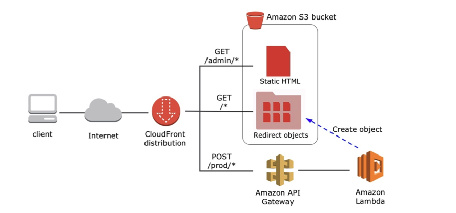

[TOC]
# URLShortener cloudformation
---

Demo site
https://d37tkiq2smw4w3.cloudfront.net/admin/

## run this command for the deployment warpped in the scirpt

`bash URLShortener-deploy.sh`
 
## This CF template contains multiple parts of aws service.

1. s3 bucket for redirect
2. api gateway for receving requests( URL endpoint )
3. two lambda function EX: one is for radoming the string and another is for http handlerq
4. cloudfront for http method whitelist

## The system is highly available and scalable via AWS managed service, we use aws provided service so we don't have to worry about the infra capacity under the hood. It's a suggested way for using cloud service as the system design basis.

1. For API gateway limit 
Rate Limit: default 10,000 Per Account Per Region. (Soft Limit)
Throttle limits: bucket limit 5000 fixed.
2. For s3
3,500 PUT/COPY/POST/DELETE or 5,500 GET/HEAD requests per second

Reference
https://aws.amazon.com/tw/blogs/compute/build-a-serverless-private-url-shortener/
